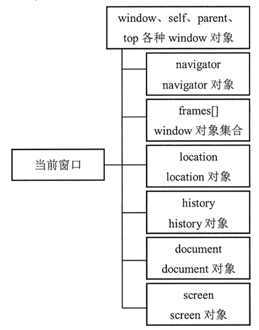

# BOM

[参考页面](http://c.biancheng.net/js/bom/)

- JS 浏览器对象模型（Browser Object Model, BOM）被广泛应用于 Web 开发之中，主要用于客户端浏览器的管理。

- BOM 概念比较古老，但是一直没有被标准化，不过各主流浏览器均支持 BOM，都遵守最基本的规则和用法，W3C 也将 BOM 主要内容纳入了 HTML5 规范之中。

## window 对象

- BOM的核心对象是window，表示浏览器的一个实例。
- 在浏览器中，window对象有双重角色，既是通过JS访问浏览器窗口的一个接口，也是ECMAScript规定的全局对象。
- 一个 window 对象实际上就是一个独立的窗口，对于框架页面来说，浏览器窗口**每个框架**都包含一个 window 对象。



### 全局作用域

- 在客户端浏览器中，window 对象是访问 BOM 的接口，如引用 document 对象的 document 属性，引用自身的 window 和 self 属性等。同时 window 也为客户端 JavaScript 提供全局作用域。
- 由于 window 是全局对象，因此所有的全局变量都被解析为该对象的属性

```js
var a = "window.a";  //全局变量
function f () {  //全局函数
    console.log(a);
}
console.log(window.a);  //返回字符串“window.a”
window.f();  //返回字符串“window.a”
```

### 窗口关系与框架

- 对于框架页面来说，浏览器窗口**每个框架**都包含一个 window 对象。
- top对象始终指向最高（最外）层的框架，也就是浏览器窗口。
- parent对象，始终指向当前框架的直接上层框架。
- 在某些情况下parent可能等于top
- 在没有框架的情况下，parent===top===window

### 导航和打开窗口

- `window.open (URL, name, features, replace)`
- 参数列表如下：
  - URL：可选字符串，声明在新窗口中显示网页文档的 URL。如果省略，或者为空，则新窗口就不会显示任何文档。
  - name：可选字符串，声明新窗口的名称。这个名称可以用作标记 <a> 和 <form> 的 target 目标值。如果该参数指定了一个已经存在的窗口，那么 open() 方法就不再创建一个新窗口，而只是返回对指定窗口的引用，在这种情况下，features 参数将被忽略。
  - features：可选字符串，声明了新窗口要显示的标准浏览器的特征，具体说明如下表所示。如果省略该参数，新窗口将具有所有标准特征。
  - replace：可选的布尔值。规定了装载到窗口的 URL 是在窗口的浏览历史中创建一个新条目，还是替换浏览历史中的当前条目。
- **新创建的 window 对象拥有一个 opener 属性，引用打开它的原始对象**。opener 只在弹出窗口的最外层 window 对象（top）中定义，而且指向调用 window.open() 方法的窗口或框架。
- 使用 window 的 close() 方法可以关闭一个窗口
- 使用 window.closed 属性可以检测当前窗口是否关闭，如果关闭则返回 true，否则返回 false。

### 定时器的使用

#### 事件循环

采纳 JSC 引擎的术语，**把宿主发起的任务称为宏观任务**，把 **JavaScript 引擎发起的任务称为微观任务**。

在底层的 C/C++ 代码中，这个事件循环是一个跑在**独立线程中的循环**，我们用伪代码来表示，大概是这样的：

```js
while(true) {
    r = wait();
    execute(r);
}
```

**执行过程大概分为4步：**

1. 先执行主线程的任务。
2. 当主线程空闲时从任务队列读取任务执行
3. 即使主线程阻塞了，任务队列还是会继续接受任务
4. 反复“等待 - 执行”

**这里每次的执行过程，其实都是一个宏观任务**。
**宏观任务的队列就相当于事件循环。**

在宏观任务中，JavaScript 的 Promise 还会产生异步代码，JavaScript 必须保证这些异步代码在一个宏观任务中完成，因此，**每个宏观任务中又包含了一个微观任务队列**。

有了宏观任务和微观任务机制，我们就可以实现 JavaScript 引擎级和宿主级的任务了，例如：**Promise 永远在队列尾部添加微观任务**。**setTimeout 等宿主 API，则会添加宏观任务**。
**微任务始终先于宏任务**,下面代码执行结果"c1->c2->d"

```js
    setTimeout(()=>console.log("d"), 0)
    var r = new Promise(function(resolve, reject){
        resolve()
    });
    r.then(() => {
        var begin = Date.now();
        while(Date.now() - begin < 1000);
        console.log("c1")
        new Promise(function(resolve, reject){
            resolve()
        }).then(() => console.log("c2"))
    });
```

```js
    function sleep(duration) {
        return new Promise(function(resolve, reject) {
            console.log("b");
            setTimeout(resolve,duration);
        })
    }
    console.log("a");
    sleep(5000).then(()=>console.log("c"));
```

执行结果是"a->b->c"。关键点：**setTimeout 把整个代码分割成了 2 个宏观任务，这里不论是 5 秒还是 0 秒，都是一样的。**

**如何分析异步执行的顺序：**

- 首先我们分析有多少个宏任务；
- 在每个宏任务中，分析有多少个微任务；
- 根据调用次序，确定宏任务中的微任务执行次序；
- 根据宏任务的触发规则和调用次序，确定宏任务的执行次序；
- 确定整个顺序。

#### setTimeout()

setTimeout() 方法能够在指定的时间段后执行特定代码。用法如下：
`var o = setTimeout(code, delay);`

参数 code 表示要延迟执行的字符串型代码，将在 Windows 环境中执行，如果包含多个语句，应该使用分号进行分隔。delay 表示延迟时间，以毫秒为单位。

该方法返回值是一个 Timer ID，这个 ID 编号指向延迟执行的代码控制句柄。如果把这个句柄传递给 clearTimeout() 方法，则会取消代码的延迟执行。

#### setInterval()

setInterval() 方法能够周期性执行指定的代码，如果不加以处理，那么该方法将会被持续执行，直到浏览器窗口关闭或者跳转到其他页面为止。用法如下：
`var o = setInterval (code, interval)`

该方法的用法与 setTimeout() 方法基本相同，其中参数 code 表示要周期执行的代码字符串，参数 interval 表示周期执行的时间间隔，以毫秒为单位。

该方法返回值是一个 Timer ID，这个 ID 编号指向对当前周期函数的执行引用，利用该值对计时器进行访问，如果把这个值传递给 clearTimeout() 方法，则会强制取消周期性执行的代码。

如果 setInterval() 方法的第 1 个参数是一个函数，则 setInterval() 方法可以接收任意多个参数，这些参数将作为该函数的参数使用。格式如下：
`var o = setInterval(functioin, interval[,arg1, arg2, ... argn])`

window 对象定义了 3 组方法分别用来调整窗口位置、大小和滚动条的偏移位置：moveTo() 和 moveBy()、resizeTo() 和 resizeBy()、scrollTo() 和 scrollBy()。
